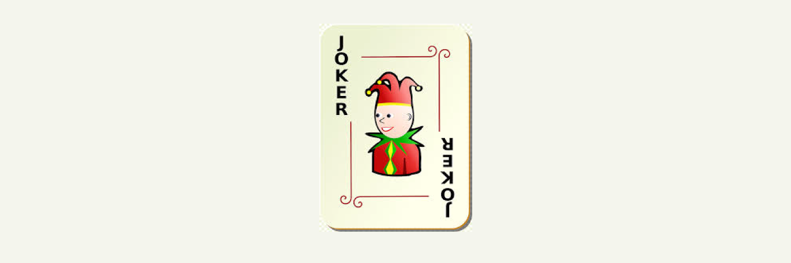
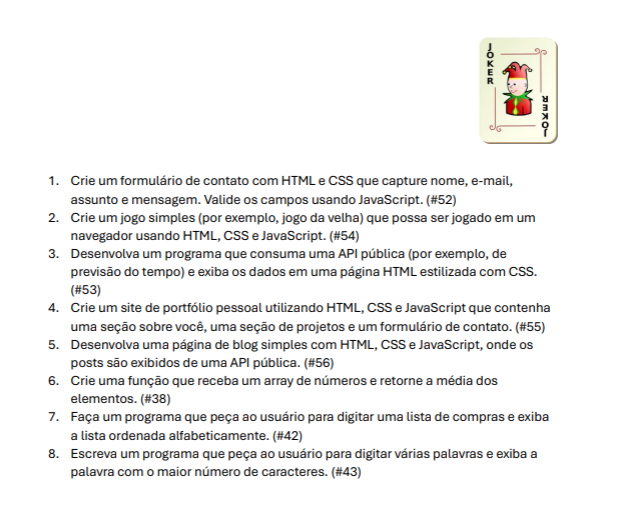
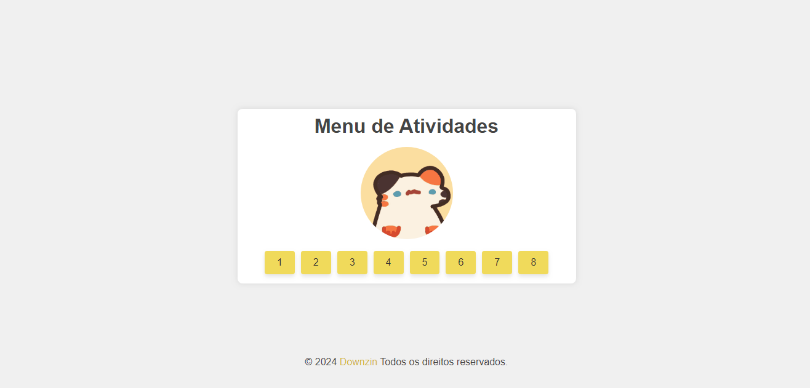

<h1 align="center">✨ Atividades Individuais [Joker00] 🤡</h1>

> Este repositório é dedicado para realização de atividades do curso TI24, proposto pelo docente [Paulo](https://github.com/paulowh). Aqui você encontrará informações, exemplos e recursos úteis para auxiliar no aprendizado de linguagem de programação e desenvolvimento web com HTML, CSS e JS.

<section align="center">
    <h2>✨ Linguagens & Tecnologias Usadas para o desenvolvimento desse repositório</h2>
    <div>
        
        
        
        
        
        
    </div>
</section>


<div align="center">
    <h1>📃 Lista</h1>
    
</div>

<h1>Navegação</h1>
<div>
    
    <a href="./src/formulario/README.md">
        
    </a>
    <br>
</div>
<div>
    
    <a href="./src/jogoDaVelha/README.md">
        
    </a>
    <br>
</div>
<div>
    
    <a href="./src/previsaoDoTempo/README.md">
        
    </a>
    <br>
</div>
<div>
    
    <a href="./src/portfolio/README.md">
        
    </a>
    <br>
</div>
<div>
    
    <a href="./src/blog/README.md">
        
    </a>
    <br>
</div>
<div>
    
    <a href="./src/mediaArray/README.md">
        
    </a>
    <br>
</div>
<div>
    
    <a href="./src/listaCompras/README.md">
        
    </a>
    <br>
</div>
<div>
    
    <a href="./src/maiorPalavra/README.md">
        
    </a>
    <br>
</div>


<div align="center">
  <h2>💻 Preview プレビュー</h2>
  <a href="http://Joker00.vercel.app">
    
  </a>
    <a href="http://downzin01.github.io/Joker00/">
    
  </a>
  <br>
  <a href="http://Joker00.vercel.app">
    
  </a>
</div>

<h1 align="center">💻 Clonagem do repositório</h1>

Baixe e instale o [GIT](https://git-scm.com/)

```bash
# Clone esse repositório
git clone https://github.com/Downzin01/Joker00.git
```
```bash
# Vá para o repositório 
cd Joker00
```

<h1 align="center">💛 Contribuindo</h1>

> Gostaria de contribuir com suas próprias anotações ou recursos adicionais, sinta-se à vontade para fazer um fork deste repositório, adicionar suas contribuições e enviar um pull request. Sua colaboração é valorizada e pode ajudar outros alunos no aprendizado de JavaScript!

<section align='center'>
    <h3>💻 Contato 接触</h3>
    <p>
        <a href="mailto:dantasmatheus001@gmail.com">
            
        </a>
        <a href="https://www.instagram.com/downzin_" rel="nofollow">
            
        </a>
        <a href="https://x.com/DownloaderChan1" rel="nofollow">
            
        </a>
        <a href="https://discord.com/users/576935681167982595">
            
        </a>
    </p>
</section>


