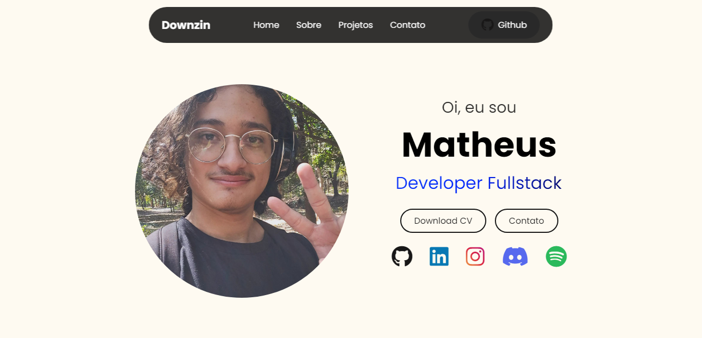

# Portfólio

> Crie um site de portfólio pessoal utilizando HTML, CSS e JavaScript que contenha uma seção sobre você, uma seção de projetos e um formulário de contato. (#55)

  <h2>💻 Preview プレビュー</h2>
  
    
   
  

