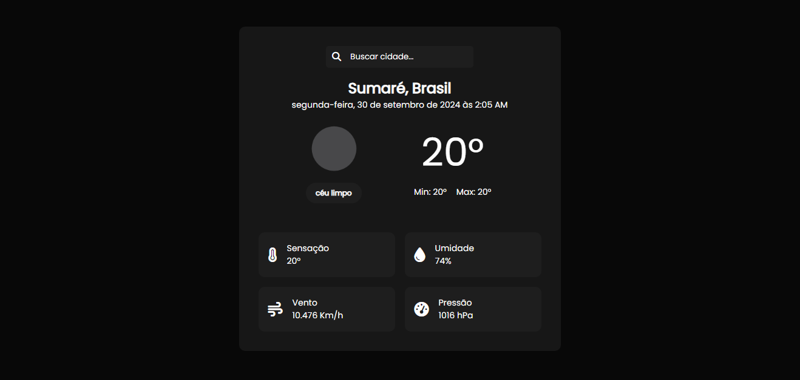

# Previsão do tempo

> Desenvolva um programa que consuma uma API pública (por exemplo, de previsão do tempo) e exiba os dados em uma página HTML estilizada com CSS.(#53)

  <h2>💻 Preview プレビュー</h2>
  
    
   
  

